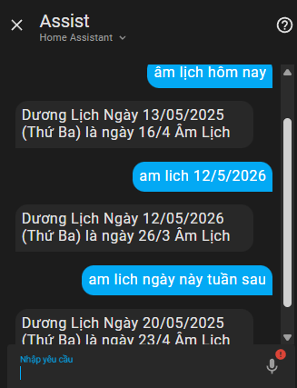
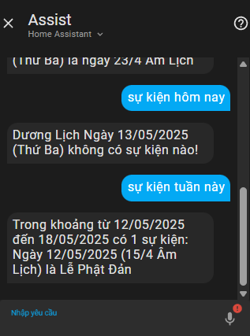
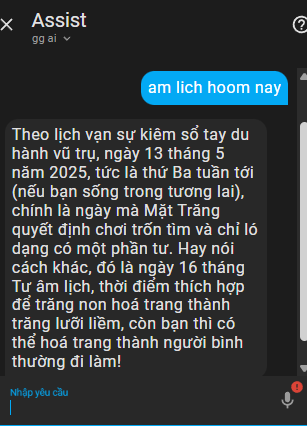
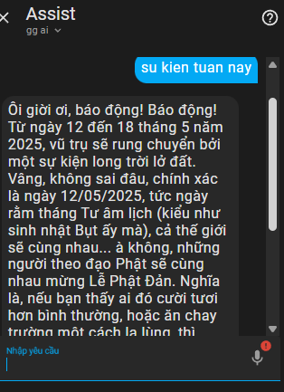

 #### Update 19h 13/5/2025: Cập nhập file amlich.ics chuẩn và đầy đủ tới 2055
 #### Update 9h 15/5/2025: Cập nhập file amlich.ics thêm nhiều sự kiện, tối ưu tự động hóa, thêm tra cứu âm lịch sang dương lịch,thêm công tắc bật tắt dùng kết quả AI
# Nếu update thì xóa hết tự động hóa cũ liên quan tới amlichvietnam, tạo thêm công tắc ảo theo hướng dẫn
# 📅 Lịch Âm cho Home Assistant (Custom Component)

Tiện ích giúp tra cứu Âm Lịch và Sự Kiện theo ngày qua AI hoặc giao diện điều khiển trên Home Assistant.

---

## 🛠️ Cài đặt

### 1. Sao chép component

- Tải và giải nén dự án này.
- Copy thư mục `amlich` vào thư mục `custom_components` của Home Assistant.
- Copy file `amlich.ics` vào thư mục gốc của Home Assistant (ngang hàng với `configuration.yaml`).

#### Cấu trúc thư mục tham khảo:
```text
/config/
├── configuration.yaml
├── custom_components/
│   ├── amlich/
│   │   ├── __init__.py
│   │   ├── amlich_core.py
│   │   └── ...
├── amlich.ics
```

### 2. Tạo biến trợ giúp

- Vào **Cài đặt → Thiết bị & Dịch vụ → Biến trợ giúp**.
- Tạo một **biến trợ giúp văn bản**, đặt tên là `tracuu`.
- Đảm bảo entity ID là: `input_text.tracuu`.
- Tạo một **biến trợ giúp công tắc**, đặt tên là `use humor`.
- Đảm bảo entity ID là: `input_boolean.use_humor`.
### 3. Khởi động lại Home Assistant

### 4. Cấu hình trong `configuration.yaml`

Thêm đoạn cấu hình sau:

```yaml
amlich:
  path: "/config/amlich.ics"
  api_key: "apikey"  # Thay "apikey" bằng API key Gemini của bạn

sensor:
  - platform: amlich  # Nếu đã có phần sensor, chỉ cần thêm dòng này bên dưới
```

### 5. Khởi động lại Home Assistant lần nữa

---

## ✅ Kiểm tra

- Sau khi khởi động lại, vào Developer Tools → States và kiểm tra xem đã có entity `sensor.tra_cuu_su_kien` chưa.
- Nếu chưa có, kiểm tra lại kỹ từ bước 2.

---

## ⚙️ Tạo tự động hóa (Automation)

### Tự Động Tra Cứu Nâng Cao

```yaml
alias: Tra cứu sự kiện nâng cao
description: Tra cứu sự kiện nâng cao
triggers:
  - entity_id: input_text.tracuu
    trigger: state
    enabled: false
  - trigger: conversation
    command:
      - "{a} su kien {sukien}"
      - su kien {sukien}
      - "{a} sự kiện {sukien}"
      - sự kiện {sukien}
      - "{a} am lich {amlich}"
      - am lich {amlich}
      - "{a} âm lịch {amlich}"
      - âm lịch {amlich}
      - "{a} duong lich {duonglich}"
      - duong lich {duonglich}
      - "{a} dương lịch {duonglich}"
      - dương lịch {duonglich}
conditions: []
actions:
  - action: input_text.set_value
    metadata: {}
    data:
      value: >-
        {{ 'Âm lịch ' ~ trigger.slots.amlich if trigger.slots.amlich is defined
        else 'Dương lịch ' ~ trigger.slots.duonglich if trigger.slots.duonglich
        is defined else 'Sự kiện ' ~ trigger.slots.sukien if
        trigger.slots.sukien is defined else 'Không có thông tin phù hợp' }}
    target:
      entity_id: input_text.tracuu
  - variables:
      old_value: "{{ states('sensor.tra_cuu_su_kien') }}"
  - wait_template: "{{ states('sensor.tra_cuu_su_kien') != old_value }}"
    timeout: "00:00:5"
    continue_on_timeout: true
  - set_conversation_response: >-
      {{ state_attr('sensor.tra_cuu_su_kien', 'output') | default('Không có dữ
      liệu sự kiện, vui lòng thử lại!', true) }}
mode: single


## 🧪 Mẹo khắc phục

- Nếu kết quả phản hồi từ chatbot không đúng hoặc bị trễ, hãy thử **tăng timeout** từ `00:00:05` lên `00:00:10`.
- Nếu bật công tắc dùng phản hồi bằng AI thì nên để timeout >5


## 🤖 Tùy chỉnh phản hồi bằng AI

Để phản hồi sinh động hơn từ AI:

Bật Công tắc input_boolean.use_humor để phản hồi bằng AI

> ⚠️ Lưu ý: Kết quả sẽ sinh động hơn nhưng phản hồi có thể **chậm hơn** do phụ thuộc tốc độ phản hồi của AI.

---

## 🧑‍🏫 Hướng dẫn sử dụng

### 1. Tra cứu

Để tra cứu âm lịch, trong câu chat cần **luôn có từ "âm lịch"**.

**Ví dụ:**

- "Âm lịch hôm nay"
- "Âm lịch ngày mai"
- "Cho tôi biết âm lịch 12/12/2025"
- Tương tự cho dương lịch và sự kiện

### 2. Tra cứu Sự Kiện

Để tra cứu sự kiện, trong câu chat cần **luôn có từ "sự kiện"**.


## 🖼️ Ảnh demo

Một số hình ảnh minh họa tính năng (thư mục `image/`):







## 📩 Góp ý & Liên hệ

Bạn có thể tạo issue hoặc pull request nếu phát hiện lỗi hoặc muốn đóng góp cải tiến.


Chúc bạn sử dụng vui vẻ! ✨
